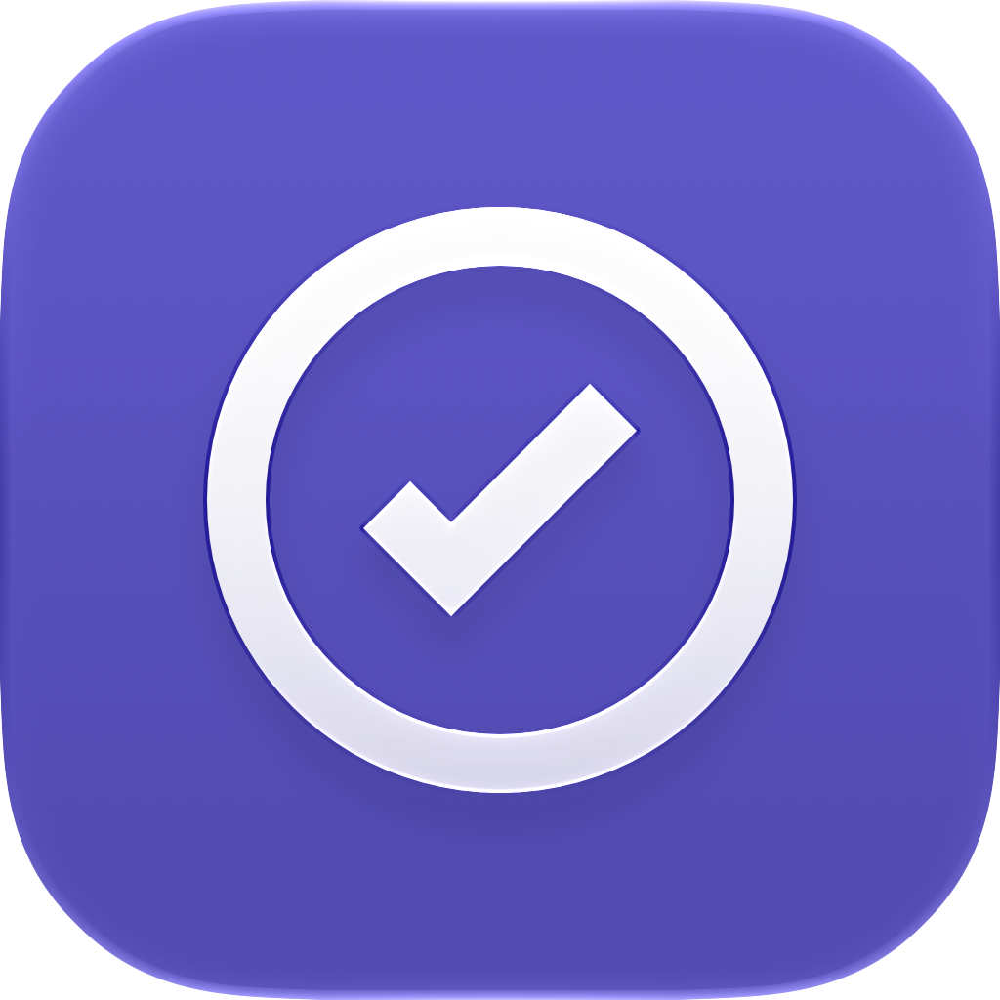

<p align="center">
  
</p>

<h1 align="center">Prestamos App</h1>

<p align="center">
  <strong>Gestiona préstamos personales, registra pagos y recibe recordatorios automáticos.</strong>
</p>

<p align="center">
  
  
  
  
  
  
</p>

---

## 📋 Descripción

**Prestamos App** es una aplicación Android nativa diseñada para llevar el control de préstamos de dinero entre personas. Permite registrar a quién le prestaste, el monto total, la cuota mensual y la fecha de inicio. A partir de ahí, la app calcula automáticamente los meses vencidos, los pagos adelantados y el saldo pendiente, y te envía notificaciones el día de cobro y cuando un pago está atrasado.

Ideal para quienes prestan dinero a familiares o amigos y necesitan una forma simple y clara de recordar quién debe, cuánto y desde cuándo.

---

## ✨ Características

- **Registro de personas**: agrega nombre, monto del préstamo, pago mensual y fecha de inicio.
- **Cálculo automático de meses**: genera la lista de meses a cobrar desde la fecha de inicio.
- **Historial de pagos**: marca los meses que la persona ya pagó y visualiza el detalle de cada uno.
- **Estado visual**: etiquetas de "Al día", "Debe X meses" o "Préstamo cancelado" con colores distintivos.
- **Notificaciones automáticas**:
  - Recordatorio el día exacto de cobro.
  - Aviso 3 días después si el pago no se registró.
- **Cancelación de préstamo**: cierra la cuenta cuando la persona devuelve todo.
- **Interfaz moderna**: construida con Jetpack Compose y Material 3, con tema claro en tonos morados.
- **Persistencia local**: los datos se guardan en Room (SQLite) en el dispositivo.

---

## 📸 Capturas de pantalla

| Home | Detalle | ¿Qué meses pagó? |
|------|---------|-------------------|
| `screenshots/home.png` | `screenshots/detalle.png` | `screenshots/meses.png` |

---

## 🛠️ Tecnologías utilizadas

| Tecnología | Uso |
|------------|-----|
| **Kotlin** | Lenguaje principal |
| **Jetpack Compose** | UI declarativa |
| **Material 3** | Componentes de diseño |
| **Room** | Base de datos local (SQLite) |
| **WorkManager** | Tareas periódicas para notificaciones |
| **Coroutines & Flow** | Asincronía y streams de datos |
| **ViewModel** | Gestión de estado y lógica de UI |
| **Navigation Compose** | Navegación entre pantallas |
| **Java Time API** | Manejo de fechas y meses |

---

## 📁 Estructura del proyecto

```text
prestamos-app/
├── app/
│   ├── src/
│   │   ├── main/
│   │   │   ├── java/com/josh/prestamos/
│   │   │   │   ├── MainActivity.kt          # Actividad principal y navegación
│   │   │   │   ├── Entidades.kt             # Entidades Room, DAO y base de datos
│   │   │   │   ├── Logica.kt                # Lógica de negocio (cálculo de meses)
│   │   │   │   ├── HomeScreen.kt            # Pantalla principal (lista de personas)
│   │   │   │   ├── HomeViewModel.kt         # ViewModel con estado de la UI
│   │   │   │   ├── Avisos.kt                # Notificaciones y Worker
│   │   │   │   ├── Componentes.kt           # Colores, formatos y componentes UI
│   │   │   │   ├── Pantallas.kt             # Detalle, formulario y hoja de pagos
│   │   │   │   └── ui/theme/                # Tema de Compose
│   │   │   ├── res/                         # Recursos (strings, drawables, mipmaps)
│   │   │   └── AndroidManifest.xml
│   │   ├── androidTest/                     # Pruebas instrumentadas
│   │   └── test/                            # Pruebas unitarias
│   └── build.gradle.kts
├── icons/                                   # Íconos de la app (PNG y SVG)
├── gradle/
├── build.gradle.kts
├── gradle.properties
└── Readme.md
```

---

## 🚀 Instalación y uso

### Requisitos previos

- Android Studio Ladybug o superior.
- JDK 11 o superior.
- Dispositivo o emulador con Android 8.0 (API 26) o superior.

## 📱 Uso de la aplicación

1. **Agregar persona**: toca el botón flotante **"Agregar"**, completa nombre, monto del préstamo, pago mensual y fecha de inicio.
2. **Ver detalles**: toca cualquier tarjeta para ver el historial de meses, el total cobrado y el próximo cobro.
3. **Registrar pago**: en el detalle, toca **"Me pagó"**, selecciona los meses que pagó y confirma.
4. **Quitar pago**: toca un mes ya pagado para eliminarlo del historial (volverá a aparecer como pendiente).
5. **Cancelar préstamo**: usa **"Devolvió el préstamo"** para cerrar la cuenta.
6. **Notificaciones**: la app programa un recordatorio diario a las 9:00 AM para avisarte de cobros y pagos atrasados.

---

## 🔔 Notificaciones

La app utiliza **WorkManager** para programar una tarea periódica diaria que:

- Detecta si hoy es el día de cobro de algún préstamo activo y muestra: *"Hoy toca cobrar: [Nombre] · [Monto]"*.
- Detecta si un pago lleva 3 días de atraso y muestra: *"[Nombre] no ha pagado: Falta el pago de [Mes]"*.

Los permisos de notificación se solicitan automáticamente en Android 13+.

---

## 🧪 Datos de prueba

Para probar la app sin usar datos reales, puedes agregar personas ficticias como:

- **Nombre**: Juan Pérez
- **Préstamo**: S/ 500
- **Pago mensual**: S/ 50
- **Fecha de inicio**: hace 3 meses

Así verás meses vencidos, un mes próximo y podrás simular pagos.

---

## 📄 Licencia

Este proyecto está bajo la Licencia MIT. Consulta el archivo `LICENSE` para más detalles.

---

## 👤 Autor

**Joshua Terrones**

- GitHub: [@JoshuaTerrones](https://github.com/JoshuaTerrones)

---

<p align="center">
  Hecho con ❤️ para simplificar el control de préstamos personales.
</p>
